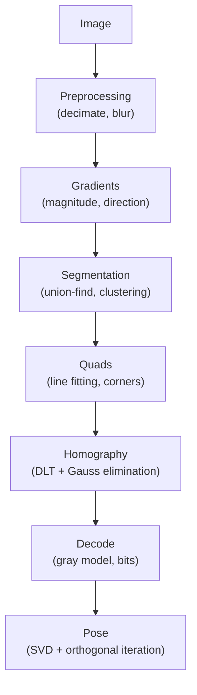

# apriltag-rs

Pure Rust implementation of the [AprilTag](https://april.eecs.umich.edu/software/apriltag) visual fiducial system. WASM-compatible.

<!-- Badges auto-updated by CI on push to main (see .github/workflows/stats.yml) -->
[](https://github.com/benlenarts/apriltag-rs/actions/workflows/ci.yml)
[](https://github.com/benlenarts/apriltag-rs/actions/workflows/ci.yml)
[](https://github.com/benlenarts/apriltag-rs/actions/workflows/stats.yml)
[](https://github.com/benlenarts/apriltag-rs/actions/workflows/stats.yml)
[](#safety)
[](LICENSE)

## At a glance

| Metric | Value |
|--------|-------|
| **Performance** | Comparable to C reference ([benchmark](#performance)) |
| **Tests** | 377 unit + integration tests |
| **Coverage** | 99.5% line coverage (cargo-llvm-cov) |
| **Regression suite** | 59 scenarios, all passing |
| **Safety** | `#![forbid(unsafe_code)]` in all production crates |
| **Code** | ~18k lines of pure Rust |

> All numbers above are auto-updated by CI on every push to main.
> See [`.github/badges/`](.github/badges/) for the raw data.

## Features

- **Pure Rust** — `forbid(unsafe_code)`, minimal dependencies, 99.5% test coverage
- **WASM-compatible** — runs in the browser via WebAssembly
- **All standard tag families** — Tag16h5, Tag25h9, Tag36h11, Standard41h12, Standard52h13, Circle21h7, Circle49h12, Custom48h12
- **Tag generation** — generate and render tag family bitmaps
- **Optional parallelism** — multi-threaded detection via Rayon

## Performance

Detection performance is comparable to the [reference C implementation](https://github.com/AprilRobotics/apriltag) (apriltag3). Faster on clean scenes, currently slightly slower on noisy scenes with many edges.

Run the benchmarks yourself (requires `just fetch-references` first):

```bash
just sim-ref benchmark   # quick: single-threaded Rust vs C comparison
just bench-par           # full: sweep across 1, 2, 4, 8 threads
just bench               # Criterion microbenchmarks (per-stage and end-to-end)
```

For streaming/real-time use, `DetectorBuffers` pools all internal allocations and reuses them across frames.

## Safety

All production crates enforce `#![forbid(unsafe_code)]`. The only exception is the optional C reference FFI bridge in `apriltag-bench` (`deny(unsafe_code)`, gated behind the `reference` feature), used exclusively for benchmark comparison and never compiled by default.

## Crates

| Crate | Description |
|-------|-------------|
| `apriltag` | Core detection library — types, families, rendering, and the full detection pipeline |
| `apriltag-gen` | Tag family generation (codegen and legacy upgrade) |
| `apriltag-gen-cli` | CLI for generating and rendering tag families |
| `apriltag-detect-cli` | CLI for detecting tags in images |
| `apriltag-wasm` | WASM bindings for detection |
| `apriltag-bench` | Detection test harness, benchmarks, and regression suite |
| `apriltag-bench-wasm` | WASM bindings for the benchmark scene generator |

## Quick start

```toml
[dependencies]
apriltag = { git = "https://github.com/benlenarts/apriltag-rs.git" }
```

### Detect tags in an image

```rust
use apriltag::{Detector, ImageRef};
use apriltag::family;

// Zero-copy view of existing grayscale pixels
let img = ImageRef::from_pixels(width, height, &pixels);

// Create a detector with default settings
let mut detector = Detector::builder()
    .add_family(family::tag36h11(), 2)
    .build();

let detections = detector.detect(&img, &mut Detector::buffers());
for det in &detections {
    println!("id={} center={:?}", det.id, det.center);
}
```

The detector accepts any `&impl GrayImage` — use `ImageRef` for zero-copy detection from a `&[u8]` slice, or `ImageU8` for owned images. You can implement `GrayImage` for your own image types.

### Detect tags from the CLI

```bash
cargo run -p apriltag-detect-cli -- input.png
```

### Build for WASM

```bash
wasm-pack build apriltag-wasm --target web
```

## Tag families

All standard families are supported: Tag16h5, Tag25h9, Tag36h11, Standard41h12, Standard52h13, Circle21h7, Circle49h12, and Custom48h12. Each family is included at compile time via feature flags — enable only what you need to reduce binary size:

```toml
[dependencies]
apriltag = { version = "0.1", default-features = false, features = ["family-tag36h11"] }
```

To generate custom tag families, see the [`apriltag-gen-cli` README](apriltag-gen-cli/README.md).

## Detection Architecture



Each stage is independently benchmarked and tested. With the `parallel` feature, all major stages run on Rayon's thread pool.

## References

- Olson, E. "AprilTag: A robust and flexible visual fiducial system." ICRA 2011.
- Wang, J. and Olson, E. "AprilTag 2: Efficient and robust fiducial detection." IROS 2016.
- Krogius, M., Haggenmiller, A., and Olson, E. "Flexible Layouts for Fiducial Tags." IROS 2019.
- Abbas, S.M. et al. "Analysis and Improvements in AprilTag Based State Estimation." Sensors 2019.

## License

BSD 2-Clause — see [LICENSE](LICENSE) for details.
